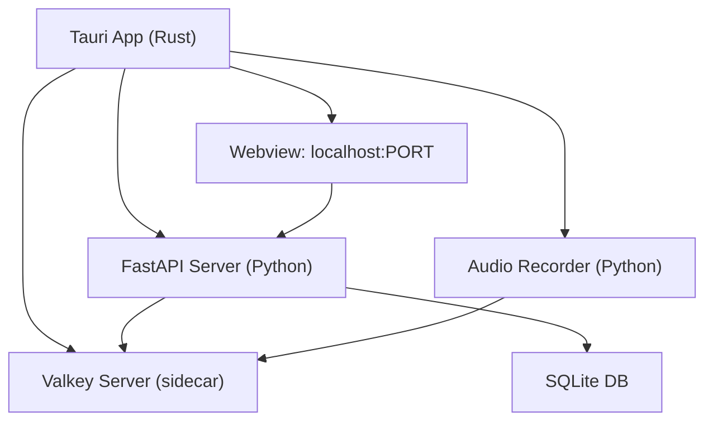
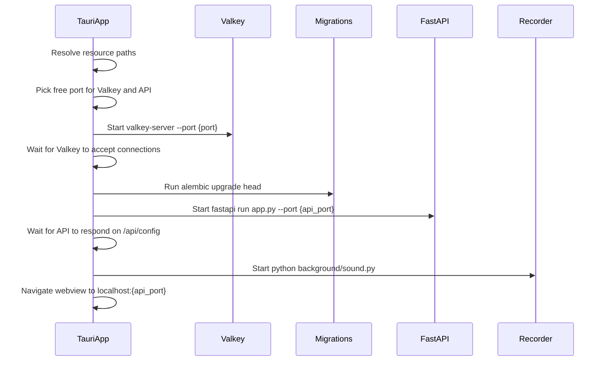

# Tauri Native Build Mode for Pidentify

## Architecture Overview

The native app wraps the existing stack in a Tauri v2 shell. The Rust layer manages process lifecycle; the Python backend and Valkey run as child processes. The webview points at `http://localhost:{port}` where FastAPI serves both the API and the built SPA -- zero changes to how the frontend communicates with the backend.




**What stays untouched:** `server/`, `web/`, `Dockerfile`, `.github/`, and all existing code. No Redis-related code changes.

---

## Project Structure (new files only)

```
pidentify/
├── src-tauri/                    # Tauri Rust application
│   ├── Cargo.toml
│   ├── tauri.conf.json
│   ├── build.rs
│   ├── capabilities/
│   │   └── default.json
│   ├── icons/                    # App icons (generated by tauri)
│   └── src/
│       ├── main.rs               # Entry point
│       └── lib.rs                # Sidecar management, app setup
├── scripts/
│   └── build-native.sh           # Orchestrates the full native build
```

The build script produces this layout inside `src-tauri/` at build time (gitignored):

```
src-tauri/
├── binaries/
│   └── valkey-server-{target_triple}    # Valkey sidecar binary
└── resources/
    ├── python/                          # python-build-standalone distro
    ├── server/                          # Copy of server/ source
    ├── static/                          # Built frontend (from web/)
    └── venv/                            # Python virtualenv with deps
```

---

## Phase 1: Scaffold Tauri v2 Project

Create `src-tauri/` with:

- `**Cargo.toml**` -- Depends on `tauri` v2 with the `shell` feature (for sidecar/command spawning). Also `serde`, `serde_json`, `tauri-plugin-shell`, `tauri-plugin-process`.
- `**tauri.conf.json**` -- Key settings:
  - `build.frontendDist` not used (webview loads `http://localhost:{port}` at runtime)
  - `build.devUrl`: `http://localhost:8000` for dev mode
  - `build.beforeBuildCommand`: calls `scripts/build-native.sh`
  - `app.security.dangerousRemoteDomainIpcAccess` or CSP allows localhost
  - `bundle.externalBin`: `["binaries/valkey-server"]` (Tauri resolves the target triple suffix automatically)
  - `bundle.resources`: `["resources/**/*"]` to include Python, server code, and venv
  - Target platforms: macOS (.dmg) and Windows (.msi/.nsis)
- `**capabilities/default.json**` -- Grants `shell:allow-spawn`, `shell:allow-kill`, `process:allow-exit` etc.
- `**build.rs**` -- Standard Tauri build script (`tauri_build::build()`)

---

## Phase 2: Build Script (`scripts/build-native.sh`)

A shell script that prepares all runtime dependencies before `cargo tauri build` runs. Steps:

1. **Build frontend**
  - `cd web && yarn install && yarn build`
  - Vite outputs to `server/static/` (existing behavior)
  - Copy `server/static/` to `src-tauri/resources/static/`
2. **Download python-build-standalone**
  - Fetch the appropriate release from [python-build-standalone](https://github.com/indygreg/python-build-standalone) for the target OS+arch
  - macOS: `cpython-3.11.*-{x86_64|aarch64}-apple-darwin-install_only.tar.gz`
  - Windows: `cpython-3.11.*-{x86_64}-pc-windows-msvc-install_only.tar.gz`
  - Extract to `src-tauri/resources/python/`
3. **Create virtualenv and install dependencies**
  - Use the bundled Python to create a venv: `resources/python/bin/python -m venv resources/venv`
  - Install server deps: `resources/venv/bin/pip install -r` (export from poetry: `cd server && poetry export -f requirements.txt`)
  - This captures all native wheels (numpy, sounddevice, etc.) for the target platform
4. **Copy server source**
  - Copy `server/` to `src-tauri/resources/server/` (excluding `__pycache__`, `.pyc`, `poetry.lock`, `static/`)
  - Copy `src-tauri/resources/static/` into `src-tauri/resources/server/static/`
5. **Download Valkey binary**
  - Fetch pre-built Valkey from [Valkey releases](https://github.com/valkey-io/valkey/releases) for the target platform
  - Place at `src-tauri/binaries/valkey-server-{target_triple}` (Tauri sidecar naming convention)
  - macOS: build from source or use Homebrew formula extraction
  - Windows: use the Windows port or WSL (note: Valkey/Redis on Windows may need the Memurai or win-valkey fork -- this needs investigation during implementation)
6. **Add to `.gitignore**`
  - `src-tauri/binaries/`
  - `src-tauri/resources/`
  - `src-tauri/target/`

---

## Phase 3: Rust Sidecar Management (`src-tauri/src/lib.rs`)

The Rust code manages the full process lifecycle:

### Startup Sequence




### Key implementation details

- **Port selection**: Find two free ports at startup (one for Valkey, one for FastAPI) to avoid conflicts with other running instances.
- **Environment variables** passed to all Python child processes:
  - `REDIS_HOST=127.0.0.1`, `REDIS_PORT={valkey_port}`
  - `DB_URL=sqlite:///{appdata_dir}/database.db`
  - `APPDATA_DIR={appdata_dir}` (platform-appropriate, see below)
  - `MUSIC_LIBRARY_DIR={music_dir}`
  - `PYTHONPATH={resources}/server` (so `from server.xxx` imports work)
- **Platform data directories** (using Tauri's `app.path()` API or `dirs` crate):
  - macOS: `~/Library/Application Support/com.pidentify.app/config/` and `~/Music/Pidentify/`
  - Windows: `%APPDATA%/Pidentify/config/` and `%USERPROFILE%/Music/Pidentify/`
- **Process handles**: Store `Child` handles in Tauri managed state so they can be killed on shutdown.
- **Graceful shutdown**: On the Tauri `on_event(tauri::RunEvent::Exit)` or window close, kill Recorder -> FastAPI -> Valkey in order.
- **Alembic migrations**: Run as a one-shot command before starting FastAPI:
`{venv_python} -m alembic upgrade head` with `cwd` set to the server resource directory.
- **Recorder process**: The Docker setup uses `chrt -f 99` for real-time priority. On native, we skip this (it requires root and is Linux-specific). The recorder runs as a normal-priority process, which is fine for desktop use.

### Webview configuration

- On startup, the main window URL is set to `http://localhost:{api_port}` after the API is confirmed healthy.
- A splash/loading screen is shown while services start up (Tauri supports a splashscreen window pattern).

---

## Phase 4: Tauri Window and App Config

- **Window**: Single main window, `title: "Pidentify"`, reasonable default size (e.g., 1100x750), resizable.
- **CSP**: Configure to allow connections to `http://localhost:*` and `ws://localhost:*` (for WebSocket support).
- **App identifier**: `com.pidentify.app`
- **Icons**: Can use placeholder icons initially; generate proper ones later with `cargo tauri icon`.

---

## Windows-Specific Considerations

Valkey (like Redis) does not have official Windows builds. Options to investigate during implementation:

- Use the [Microsoft archive of Redis for Windows](https://github.com/microsoftarchive/redis) or a community Valkey Windows port
- Bundle Valkey under WSL2 (adds complexity)
- Use [Memurai](https://www.memurai.com/) as a Windows-native Redis-compatible server

This is the riskiest part of the Windows story and may need a spike. For initial implementation, we can focus on macOS and add Windows support once the Valkey-on-Windows strategy is confirmed.

---

## What Changes in Existing Code

**Nothing.** The plan explicitly avoids modifying any existing files. The entire native build is additive:

- New `src-tauri/` directory
- New `scripts/build-native.sh`
- Updates to root `.gitignore`

